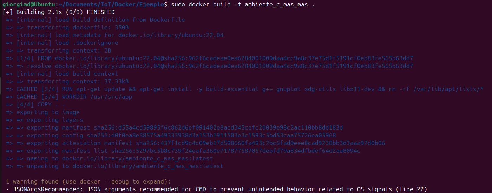
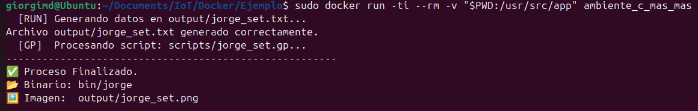

# Generación de Imagen con Gnuplot

## Descripción

Este proyecto despliega un entorno en **Docker** para compilar y ejecutar un programa en **C++** que genera un archivo de datos y, posteriormente, una **imagen PNG** usando **Gnuplot**.

El flujo general del proyecto es:

- Compilar el programa en C++
- Ejecutar el binario
- Generar un archivo de datos `.txt`
- Usar Gnuplot para crear una imagen `.png`

El resultado final es una gráfica generada automáticamente dentro del contenedor.

---

## Estructura del proyecto

~~~bash
Ejemplo/
├── Dockerfile
├── Makefile
├── src/
│   └── main.cpp
├── scripts/
│   └── jorge_set.gp
├── bin/
├── obj/
└── output/
~~~

---

## ¿Por qué se usa Gnuplot?

En este proyecto, el programa en **C++** no genera directamente la imagen final.  
Lo que hace es crear un archivo de datos con valores numéricos, y después **Gnuplot** toma esos datos para dibujar la gráfica.

En este proyecto:

- **C++** genera el archivo de datos
- **Gnuplot** transforma esos datos en una imagen
- **Docker** encapsula todo el entorno de compilación y ejecución

---

## Dockerfile

### Código

~~~dockerfile
FROM ubuntu:22.04

ENV DEBIAN_FRONTEND=noninteractive

RUN apt-get update && apt-get install -y \
    build-essential \
    g++ \
    gnuplot \
    xdg-utils \
    libx11-dev \
    && rm -rf /var/lib/apt/lists/*

WORKDIR /usr/src/app

COPY . .

ARG MAKE_TARGET=all
ENV TARGET=$MAKE_TARGET

ENV XDG_RUNTIME_DIR=/tmp

CMD make ${TARGET}
~~~

- `FROM ubuntu:22.04`: usa Ubuntu 22.04 como base
- `ENV DEBIAN_FRONTEND=noninteractive`: evita interacción durante la instalación
- `RUN ...`: instala herramientas de compilación y Gnuplot
- `WORKDIR /usr/src/app`: define la carpeta de trabajo
- `COPY . .`: copia todo el proyecto al contenedor
- `ARG MAKE_TARGET=all`: define el target por defecto
- `ENV TARGET=$MAKE_TARGET`: guarda el target como variable de entorno
- `ENV XDG_RUNTIME_DIR=/tmp`: configura el entorno gráfico
- `CMD make ${TARGET}`: arranca el proyecto con `make`

---

## Makefile

### Código

~~~makefile
#==============================================================================
#CONFIGURACIÓN DE RUTAS
#==============================================================================
CXX      := g++
CXXFLAGS := -std=c++23 -O3 -Wall

SRC_DIR     := src
SCRIPT_DIR  := scripts
OBJ_DIR     := obj
BIN_DIR     := bin
OUT_DIR     := output

APP         := $(BIN_DIR)/jorge
SOURCES     := $(wildcard $(SRC_DIR)/*.cpp)
OBJECTS     := $(SOURCES:$(SRC_DIR)/%.cpp=$(OBJ_DIR)/%.o)

GP_SCRIPT   := $(SCRIPT_DIR)/jorge_set.gp
DATA_FILE   := $(OUT_DIR)/jorge_set.txt
IMAGE_FILE  := $(OUT_DIR)/jorge_set.png

#==============================================================================
#REGLAS DE EJECUCIÓN
#==============================================================================
all: prepare $(APP) run plot show_info

.PHONY: all prepare run plot clean show_info

prepare:
	@mkdir -p $(OBJ_DIR) $(BIN_DIR) $(OUT_DIR) $(SCRIPT_DIR)

$(OBJ_DIR)/%.o: $(SRC_DIR)/%.cpp
	@echo "  [CC]  $< -> $@"
	@$(CXX) $(CXXFLAGS) -c $< -o $@

$(APP): $(OBJECTS)
	@echo "  [LD]  Creando binario: $@"
	@$(CXX) $(CXXFLAGS) $(OBJECTS) -o $@

run: $(APP)
	@echo "  [RUN] Generando datos en $(DATA_FILE)..."
	@./$(APP)

plot: $(DATA_FILE)
	@echo "  [GP]  Procesando script: $(GP_SCRIPT)..."
	@gnuplot $(GP_SCRIPT)

show_info:
	@echo "-------------------------------------------------------"
	@echo "✅ Proceso Finalizado."
	@echo "📂 Binario: $(APP)"
	@echo "🖼️  Imagen:  $(IMAGE_FILE)"
	@echo "-------------------------------------------------------"

clean:
	@echo "  [CLEAN] Borrando carpetas generadas..."
	@rm -rf $(OBJ_DIR) $(BIN_DIR) $(OUT_DIR)
~~~

Este archivo automatiza todo el proceso.  
Cuando Docker inicia el contenedor, ejecuta `make all`, y eso a su vez realiza:

~~~text
prepare → compilar → ejecutar → graficar → mostrar resultado
~~~

---

## main.cpp

### Código

~~~cpp
#include <fstream>
#include <iostream>
#include <filesystem>

int main() {
    std::filesystem::create_directories("output");

    std::ofstream file("output/jorge_set.txt");
    if (!file.is_open()) {
        std::cerr << "Error al crear output/jorge_set.txt" << std::endl;
        return 1;
    }

    for (double x = -10.0; x <= 10.0; x += 0.1) {
        double y = x * x;
        file << x << " " << y << std::endl;
    }

    file.close();
    std::cout << "Archivo output/jorge_set.txt generado correctamente." << std::endl;

    return 0;
}
~~~

- `#include <fstream>`: permite escribir archivos
- `#include <iostream>`: permite mostrar mensajes en consola
- `#include <filesystem>`: permite crear carpetas
- `create_directories("output")`: crea la carpeta `output`
- `ofstream file("output/jorge_set.txt")`: crea el archivo de datos
- `for (double x = -10.0; x <= 10.0; x += 0.1)`: recorre valores de `x`
- `double y = x * x;`: calcula la función `y = x²`
- `file << x << " " << y`: guarda los pares de datos
- `std::cout ...`: muestra un mensaje de confirmación

---

## jorge_set.gp

### Código

~~~gnuplot
set terminal png
set output 'output/jorge_set.png'
set title 'Grafica generada por Jorge'
set xlabel 'X'
set ylabel 'Y'
set grid
plot 'output/jorge_set.txt' using 1:2 with lines title 'y = x^2'
~~~

- `set terminal png`: indica que la salida será una imagen PNG
- `set output 'output/jorge_set.png'`: define el nombre del archivo de salida
- `set title ...`: coloca el título de la gráfica
- `set xlabel 'X'`: etiqueta del eje X
- `set ylabel 'Y'`: etiqueta del eje Y
- `set grid`: activa la cuadrícula
- `plot ... using 1:2 with lines`: grafica la columna 1 contra la columna 2 con líneas

---

## Construcción de la imagen

~~~bash
sudo docker build -t ambiente_c_mas_mas .
~~~

Este comando construye la imagen Docker a partir del `Dockerfile`.

---

## Ejecución del contenedor

~~~bash
sudo docker run -ti --rm -v "$PWD:/usr/src/app" ambiente_c_mas_mas
~~~

Este comando:

- ejecuta el contenedor en modo interactivo
- elimina el contenedor al finalizar
- comparte la carpeta actual con `/usr/src/app`
- permite que los archivos generados aparezcan en la carpeta local

---

## Verificación

Para comprobar que se generaron correctamente los archivos de salida:

~~~bash
ls output
~~~

Se espera encontrar:

~~~text
jorge_set.png
jorge_set.txt
~~~

También puede verificarse la salida del proceso en terminal durante la ejecución del contenedor.

---

## Acceso al resultado

Para abrir la imagen generada en Ubuntu:

~~~bash
xdg-open output/jorge_set.png
~~~

También se puede abrir manualmente desde el explorador de archivos dentro de la carpeta `output`.

---
