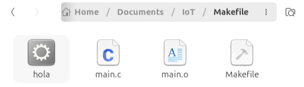

# MAKEFILE EJEMPLO

## Proyecto
Creación, análisis y ejecución de un makefile para comprender sus funcionalidades, ventajas y utilizarlos en futuros proyectos.

## Ejecucion del codigo
1. Acceder a una computadora con sistema operativo Linux.
2. Colocar los siguientes archivos en el mismo directorio:
   - **Makefile** (sin extension)
   - **main.c**
3. Abrir la terminal de comandos.
4. Moverse al directorio donde se guardaron los archivos con **cd**.
   Ejemplo:
   ```bash
   giorgimd@Ubuntu:~$ cd /Documents/IoT/Makefile
   ```
5. Compilar el codigo en C con **make** y deben aparecer los comandos que ejecutó `make`.
   Ejemplo:
   ```bash
   giorgimd@Ubuntu:~/Documents/IoT/Makefile$ make
   gcc -Wall -Wextra -O2 -c main.c -o main.o
   gcc -Wall -Wextra -O2 main.o -o hola
   ```
6. Ejecutar el programa con **./nombre**.
   Ejemplo:
   ```bash
   giorgimd@Ubuntu:~/Documents/IoT/Makefile$ ./hola
   Hola desde un ejemplo basico de Makefile.
   Este programa fue compilado y ejecutado con make.
   ```
 **Con lo anterior veremos que en el directorio se habrán creado el archivo .o y el ejecutable**
 
   
   
 ### Extra
   - Para obtener ayuda sobre las demas opciones disponibles utilizar **help** 
   Ejemplo:
   ```bash
   giorgimd@Ubuntu:~/Documents/IoT/Makefile$ make help
   Objetivos disponibles:
     make         -> compila el programa
     make run     -> compila y ejecuta
     make clean   -> elimina archivos generados
     make rebuild -> limpia y vuelve a compilar
   ```
   - make run: compila y ejecuta el programa en un solo comando sin usar make y ./ separados.
   - make clean: elimina el archivo .o y ejecutable que fueron creados al compilar el programa del directorio.
   - make rebuild: elimina los archivos creados y compila nuevamente **sin ejecutar**.

## Explicación del código

### Macros
Las macros son nombres cortos que guardan un valor para reutilizarlo después en otras partes del Makefile. Sirven para no escribir lo mismo muchas veces y para facilitar cambios. Por ejemplo, si se quiere cambiar el compilador, solo se modifica una línea y no todo el archivo.

```makefile
# Definir el compilador
CC = gcc
# Banderas para el compilador
CFLAGS = -Wall -Wextra -O2
# Nombre del ejecutable final
TARGET = hola
# Archivo fuente del proyecto
SRCS = main.c
# Reemplaza main.c por main.o
OBJS = $(SRCS:.c=.o)
```

#### Explicación de cada macro
- **CC = gcc**: guarda el nombre del compilador que se va a usar.
- **CFLAGS = -Wall -Wextra -O2**: guarda opciones para el compilador. `-Wall` activa advertencias importantes, `-Wextra` activa advertencias adicionales y `-O2` optimiza el programa.
- **TARGET = hola**: define el nombre del programa final que se va a generar.
- **SRCS = main.c**: indica cuál es el archivo fuente del proyecto.
- **OBJS = $(SRCS:.c=.o)**: cambia la extensión `.c` por `.o`, es decir, transforma `main.c` en `main.o`.

### `.PHONY` y objetivo por defecto
Estas líneas indican cuáles palabras del Makefile no representan archivos reales, sino acciones.

```makefile
# Estos objetivos no representan archivos reales
.PHONY: all run clean help rebuild
# Objetivo por defecto: compilar el programa
all: $(TARGET)
```

#### Explicación
- **.PHONY: all run clean help rebuild**: le dice a `make` que esos nombres no son archivos, sino comandos especiales.
- **all: $(TARGET)**: define el objetivo principal. Cuando se escribe solo `make`, se ejecuta este objetivo por defecto. Como `$(TARGET)` vale `hola`, al escribir `make` se le está diciendo a `make` que construya el ejecutable `hola`.

### Menú de ayuda para obtener más información
Esta parte crea una ayuda sencilla para mostrar qué hace cada comando del Makefile.

```makefile
# Muestra ayuda con los comandos disponibles
help:
	@echo "Objetivos disponibles:"
	@echo "  make         -> compila el programa"
	@echo "  make run     -> compila y ejecuta"
	@echo "  make clean   -> elimina archivos generados"
	@echo "  make rebuild -> limpia y vuelve a compilar"
```

#### Explicación
- **help:** define una acción llamada `help`.
- **@echo**: imprime texto en la terminal.
- **@**: evita que se muestre el comando antes del resultado.
Cuando se ejecuta `make help`, aparece una lista con los comandos disponibles y su función.

### Regla patrón para crear archivos `.o`
Esta parte le indica a `make` cómo convertir un archivo `.c` en un archivo `.o`.

```makefile
# Regla patrón:
# Para construir cualquier archivo .o, se necesita su archivo .c con el mismo nombre
%.o: %.c
	$(CC) $(CFLAGS) -c $< -o $@
```

#### Explicación
La línea `%.o: %.c` significa que para crear un archivo con extensión `.o`, se necesita un archivo con extensión `.c` que tenga el mismo nombre. Por ejemplo, `main.c` produce `main.o`.

La línea:

```makefile
$(CC) $(CFLAGS) -c $< -o $@
```

equivale a:

```bash
gcc -Wall -Wextra -O2 -c main.c -o main.o
```

#### Significado de cada parte
- **$(CC)**: usa el compilador guardado en `CC`.
- **$(CFLAGS)**: usa las banderas guardadas en `CFLAGS`.
- **-c**: compila, pero todavía no crea el ejecutable final.
- **$<**: representa el archivo de entrada, por ejemplo `main.c`.
- **-o**: indica el archivo de salida.
- **$@**: representa el archivo que se va a generar, por ejemplo `main.o`.

### Regla para construir el ejecutable final
Esta parte usa el archivo objeto para crear el programa final.

```makefile
# Construye el ejecutable final a partir de los archivos objeto
$(TARGET): $(OBJS)
	$(CC) $(CFLAGS) $(OBJS) -o $@
```

#### Explicación
La línea `$(TARGET): $(OBJS)` equivale a `hola: main.o`. Eso significa que para construir `hola`, primero se necesita `main.o`.

La línea:

```makefile
$(CC) $(CFLAGS) $(OBJS) -o $@
```

equivale a:

```bash
gcc -Wall -Wextra -O2 main.o -o hola
```

Esta instrucción toma el archivo `main.o` y genera el ejecutable final llamado `hola`.

### Regla para ejecutar el programa
Esta parte permite correr el programa compilado.

```makefile
# Ejecuta el programa compilado
run: $(TARGET)
	./$(TARGET)
```

#### Explicación
La línea `run: $(TARGET)` significa que, para ejecutar `run`, primero debe existir el programa final. Como `$(TARGET)` vale `hola`, entonces `./$(TARGET)` equivale a `./hola`. Esto ejecuta el programa que se encuentra en la carpeta actual. Cuando se escribe `make run`, `make` primero compila el programa si hace falta y después lo ejecuta.

### Regla para limpiar archivos generados
Esta parte elimina los archivos creados durante la compilación.

```makefile
# Elimina los archivos generados
clean:
	rm -f $(OBJS) $(TARGET)
```

#### Explicación
Durante la compilación se generan archivos nuevos, como `main.o` y `hola`. La regla `clean` sirve para borrarlos.

La línea:

```makefile
rm -f $(OBJS) $(TARGET)
```

equivale a:

```bash
rm -f main.o hola
```

- **rm**: elimina archivos.
- **-f**: fuerza la eliminación sin mostrar error si no existen.

Cuando se ejecuta `make clean`, se borran los archivos generados por la compilación.

### Regla para limpiar y volver a compilar
Esta parte sirve para borrar todo y compilar otra vez desde cero.

```makefile
# Limpia y vuelve a compilar
rebuild: clean all
```

#### Explicación
La regla `rebuild` combina dos acciones: primero `clean`, que borra los archivos generados, y después `all`, que vuelve a compilar el programa. Cuando se ejecuta `make rebuild`, primero se limpia la carpeta y después se vuelve a construir el ejecutable.

### Resumen general
Este Makefile permite:
- definir valores reutilizables mediante macros,
- establecer comandos especiales,
- mostrar ayuda en pantalla,
- convertir archivos `.c` en archivos `.o`,
- crear un ejecutable final,
- ejecutar el programa fácilmente,
- eliminar archivos generados,
- recompilar todo desde cero.
