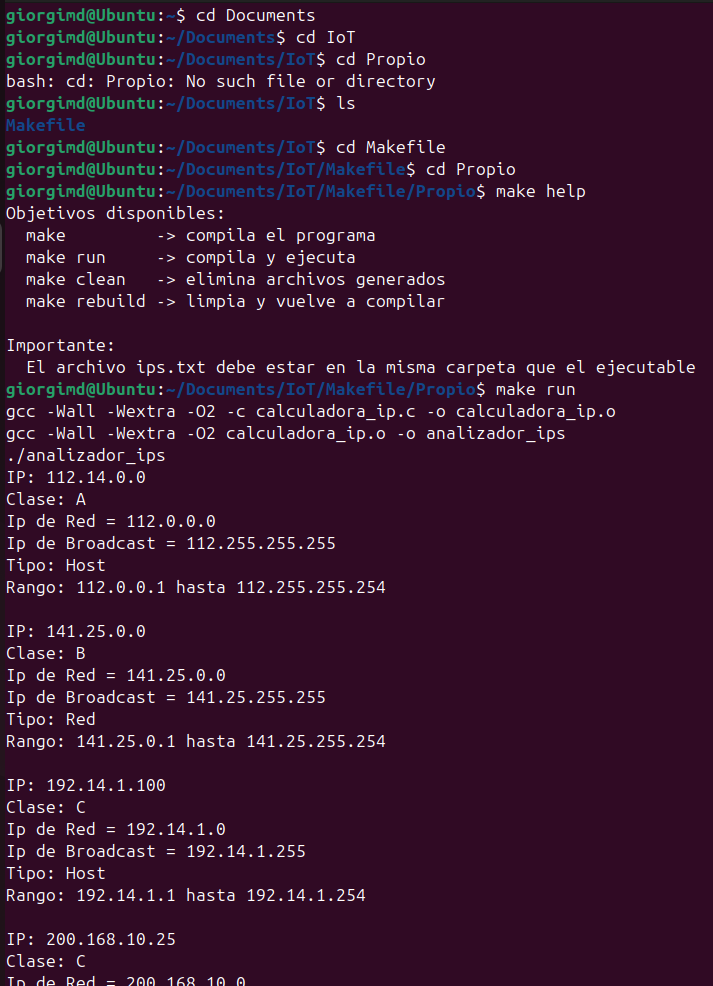

# ANALIZADOR DE IPS CON MAKEFILE

## Proyecto
Creación, análisis y ejecución de un makefile para compilar y ejecutar un programa en C que lee 10 direcciones IP desde un archivo `ips.txt`, identifica su clase y calcula información como IP de red, broadcast, tipo y rango.

## Ejecucion del codigo
1. Acceder a una computadora con sistema operativo Linux.
2. Colocar los siguientes archivos en el mismo directorio:
   - **Makefile** (sin extension)
   - **calculadora_ip.c**
   - **ips.txt**
3. Abrir la terminal de comandos.
4. Moverse al directorio donde se guardaron los archivos con **cd**.  
   Ejemplo:
   ```bash
   giorgimd@Ubuntu:~$ cd ~/Documents/IoT/Makefile/Propio
   ```
5. Compilar el codigo en C con **make** y deben aparecer los comandos que ejecutó `make`.  
   Ejemplo:
   ```bash
   giorgimd@Ubuntu:~/Documents/IoT/Makefile/Propio$ make
   gcc -Wall -Wextra -O2 -c calculadora_ip.c -o calculadora_ip.o
   gcc -Wall -Wextra -O2 calculadora_ip.o -o analizador_ips
   ```
6. Ejecutar el programa con **./nombre_del_ejecutable** o con **make run**.  
   Ejemplo:
   ```bash
   giorgimd@Ubuntu:~/Documents/IoT/Makefile/Propio$ ./analizador_ips
   IP: 112.14.0.0
   Clase: A
   Ip de Red = 112.0.0.0
   Ip de Broadcast = 112.255.255.255
   Tipo: Host
   Rango: 112.0.0.1 hasta 112.255.255.254
   ```
**Con lo anterior veremos que en el directorio se habrán creado el archivo `.o` y el ejecutable.**


### Extra
- Para obtener ayuda sobre las demas opciones disponibles utilizar **help**.  
  Ejemplo:
  ```bash
  giorgimd@Ubuntu:~/Documents/IoT/Makefile/Propio$ make help
  Objetivos disponibles:
    make         -> compila el programa
    make run     -> compila y ejecuta
    make clean   -> elimina archivos generados
    make rebuild -> limpia y vuelve a compilar

  Importante:
    El archivo ips.txt debe estar en la misma carpeta que el ejecutable
  ```
- **make run**: compila y ejecuta el programa en un solo comando.
- **make clean**: elimina el archivo `.o` y el ejecutable creados al compilar el programa.
- **make rebuild**: elimina los archivos creados y compila nuevamente **sin ejecutar**.

## Archivo de entrada `ips.txt`
El programa necesita un archivo llamado `ips.txt` en la misma carpeta que el ejecutable. Ese archivo debe contener exactamente 10 direcciones IP, una por línea.

Ejemplo:
```txt
112.14.0.0
141.25.0.0
192.14.1.100
200.168.10.25
172.16.5.200
10.0.0.1
126.255.255.255
224.1.1.1
237.69.4.221
254.10.8.47
```

## Explicación del código

### Macros
Las macros son nombres cortos que guardan un valor para reutilizarlo después en otras partes del Makefile. Sirven para no escribir lo mismo muchas veces y para facilitar cambios. Por ejemplo, si se quiere cambiar el compilador o el nombre del archivo fuente, solo se modifica una línea y no todo el archivo.

```makefile
# MACROS
CC = gcc
CFLAGS = -Wall -Wextra -O2
TARGET = analizador_ips
SRCS = calculadora_ip.c
OBJS = $(SRCS:.c=.o)
```

#### Explicación de cada macro
- **CC = gcc**: guarda el nombre del compilador que se va a usar.
- **CFLAGS = -Wall -Wextra -O2**: guarda opciones para el compilador. `-Wall` activa advertencias importantes, `-Wextra` activa advertencias adicionales y `-O2` optimiza el programa.
- **TARGET = analizador_ips**: define el nombre del programa final que se va a generar.
- **SRCS = calculadora_ip.c**: indica cuál es el archivo fuente del proyecto.
- **OBJS = $(SRCS:.c=.o)**: cambia la extensión `.c` por `.o`, es decir, transforma `calculadora_ip.c` en `calculadora_ip.o`.

### `.PHONY` y objetivo por defecto
Estas líneas indican cuáles palabras del Makefile no representan archivos reales, sino acciones.

```makefile
.PHONY: all run clean help rebuild

# Objetivo por defecto: compilar el programa
all: $(TARGET)
```

#### Explicación
- **.PHONY: all run clean help rebuild**: le dice a `make` que esos nombres no son archivos, sino comandos especiales.
- **all: $(TARGET)**: define el objetivo principal. Cuando se escribe solo `make`, se ejecuta este objetivo por defecto. Como `$(TARGET)` vale `analizador_ips`, al escribir `make` se le está diciendo a `make` que construya el ejecutable `analizador_ips`.

### Menú de ayuda para obtener más información
Esta parte crea una ayuda sencilla para mostrar qué hace cada comando del Makefile.

```makefile
# Menú de ayuda
help:
	@echo "Objetivos disponibles:"
	@echo "  make         -> compila el programa"
	@echo "  make run     -> compila y ejecuta"
	@echo "  make clean   -> elimina archivos generados"
	@echo "  make rebuild -> limpia y vuelve a compilar"
	@echo ""
	@echo "Importante:"
	@echo "  El archivo ips.txt debe estar en la misma carpeta que el ejecutable"
```

#### Explicación
- **help:** define una acción llamada `help`.
- **@echo**: imprime texto en la terminal.
- **@**: evita que se muestre el comando antes del resultado.
Cuando se ejecuta `make help`, aparece una lista con los comandos disponibles y un recordatorio de que `ips.txt` debe estar en la misma carpeta.

### Regla patrón para crear archivos `.o`
Esta parte le indica a `make` cómo convertir un archivo `.c` en un archivo `.o`.

```makefile
# Regla patrón:
# Para construir cualquier archivo .o, se necesita su archivo .c con el mismo nombre
%.o: %.c
	$(CC) $(CFLAGS) -c $< -o $@
```

#### Explicación
La línea `%.o: %.c` significa que para crear un archivo con extensión `.o`, se necesita un archivo con extensión `.c` que tenga el mismo nombre. Por ejemplo, `calculadora_ip.c` produce `calculadora_ip.o`.

La línea:

```makefile
$(CC) $(CFLAGS) -c $< -o $@
```

equivale a:

```bash
gcc -Wall -Wextra -O2 -c calculadora_ip.c -o calculadora_ip.o
```

#### Significado de cada parte
- **$(CC)**: usa el compilador guardado en `CC`.
- **$(CFLAGS)**: usa las banderas guardadas en `CFLAGS`.
- **-c**: compila, pero todavía no crea el ejecutable final.
- **$<**: representa el archivo de entrada, por ejemplo `calculadora_ip.c`.
- **-o**: indica el archivo de salida.
- **$@**: representa el archivo que se va a generar, por ejemplo `calculadora_ip.o`.

### Regla para construir el ejecutable final
Esta parte usa el archivo objeto para crear el programa final.

```makefile
# Construye el ejecutable final a partir de los archivos objeto
$(TARGET): $(OBJS)
	$(CC) $(CFLAGS) $(OBJS) -o $@
```

#### Explicación
La línea `$(TARGET): $(OBJS)` equivale a `analizador_ips: calculadora_ip.o`. Eso significa que para construir `analizador_ips`, primero se necesita `calculadora_ip.o`.

La línea:

```makefile
$(CC) $(CFLAGS) $(OBJS) -o $@
```

equivale a:

```bash
gcc -Wall -Wextra -O2 calculadora_ip.o -o analizador_ips
```

Esta instrucción toma el archivo `calculadora_ip.o` y genera el ejecutable final llamado `analizador_ips`.

### Regla para ejecutar el programa
Esta parte permite correr el programa compilado.

```makefile
# Ejecuta el programa compilado
run: $(TARGET)
	./$(TARGET)
```

#### Explicación
La línea `run: $(TARGET)` significa que, para ejecutar `run`, primero debe existir el programa final. Como `$(TARGET)` vale `analizador_ips`, entonces `./$(TARGET)` equivale a `./analizador_ips`. Esto ejecuta el programa que se encuentra en la carpeta actual. Cuando se escribe `make run`, `make` primero compila el programa si hace falta y después lo ejecuta.

### Regla para limpiar archivos generados
Esta parte elimina los archivos creados durante la compilación.

```makefile
# Elimina los archivos generados
clean:
	rm -f $(OBJS) $(TARGET)
```

#### Explicación
Durante la compilación se generan archivos nuevos, como `calculadora_ip.o` y `analizador_ips`. La regla `clean` sirve para borrarlos.

La línea:

```makefile
rm -f $(OBJS) $(TARGET)
```

equivale a:

```bash
rm -f calculadora_ip.o analizador_ips
```

- **rm**: elimina archivos.
- **-f**: fuerza la eliminación sin mostrar error si no existen.

Cuando se ejecuta `make clean`, se borran los archivos generados por la compilación.

### Regla para limpiar y volver a compilar
Esta parte sirve para borrar todo y compilar otra vez desde cero.

```makefile
# Limpia y vuelve a compilar
rebuild: clean all
```

#### Explicación
La regla `rebuild` combina dos acciones: primero `clean`, que borra los archivos generados, y después `all`, que vuelve a compilar el programa. Cuando se ejecuta `make rebuild`, primero se limpia la carpeta y después se vuelve a construir el ejecutable.

## Explicación del programa en C

### Inclusión de biblioteca y constantes
```c
#include <stdio.h>

#define TOTAL_IPS 10
```

#### Explicación
- **#include <stdio.h>**: permite usar funciones de entrada y salida como `printf`, `fopen` y `fscanf`.
- **#define TOTAL_IPS 10**: define que el programa leerá exactamente 10 direcciones IP desde el archivo.

### Variables globales
```c
unsigned char MR[4] = {255, 255, 255, 0};
unsigned char IPs[TOTAL_IPS][4];
```

#### Explicación
- **MR[4]**: guarda la máscara de red que se usará para calcular red y broadcast.
- **IPs[TOTAL_IPS][4]**: almacena las 10 direcciones IP leídas del archivo. Cada IP tiene 4 números.

### Apertura del archivo
```c
archivo = fopen("ips.txt", "r");
if (archivo == NULL) {
    printf("Error: no se pudo abrir el archivo ips.txt\n");
    return 1;
}
```

#### Explicación
Aquí el programa intenta abrir el archivo `ips.txt` en modo lectura. Si no lo encuentra o no puede abrirlo, muestra un mensaje de error y termina.

### Lectura y validación de IPs
```c
while (i < TOTAL_IPS && fscanf(archivo, "%u.%u.%u.%u", &a, &b, &c, &d) == 4) {
    if (a > 255 || b > 255 || c > 255 || d > 255) {
        printf("Error: IP invalida en la linea %d\n", i + 1);
        fclose(archivo);
        return 1;
    }

    IPs[i][0] = (unsigned char)a;
    IPs[i][1] = (unsigned char)b;
    IPs[i][2] = (unsigned char)c;
    IPs[i][3] = (unsigned char)d;
    i++;
}
```

#### Explicación
Este bloque lee una dirección IP por línea desde `ips.txt`. Cada número separado por puntos se guarda en las variables `a`, `b`, `c` y `d`. Después verifica que cada número esté entre 0 y 255. Si alguno es mayor a 255, marca error. Si la IP es válida, la guarda en la matriz `IPs`.

### Verificación de cantidad de IPs
```c
if (i < TOTAL_IPS) {
    printf("Error: el archivo debe contener exactamente %d direcciones IP\n", TOTAL_IPS);
    return 1;
}
```

#### Explicación
Después de leer el archivo, el programa revisa si realmente encontró 10 direcciones IP. Si hay menos, muestra un error y termina.

### Recorrido y análisis de cada IP
```c
for (i = 0; i < TOTAL_IPS; i++) {
```

#### Explicación
Este ciclo recorre una por una las 10 direcciones IP almacenadas para analizarlas.

### Reinicio de máscara
```c
MR[0] = 255;
MR[1] = 255;
MR[2] = 255;
MR[3] = 0;
```

#### Explicación
Antes de analizar cada IP, la máscara de red se reinicia a su valor base. Luego, dependiendo de la clase de la IP, algunos valores se modifican.

### Identificación de clase
```c
if (IPs[i][0] & 128) {
    if (IPs[i][0] & 64) {
        if (IPs[i][0] & 32) {
            if (IPs[i][0] & 16) {
                printf("Clase: E\n\n");
                continue;
            } else {
                printf("Clase: D\n\n");
                continue;
            }
        } else {
            printf("Clase: C\n");
            MR[3] = 0;
        }
    } else {
        printf("Clase: B\n");
        MR[2] = 0;
        MR[3] = 0;
    }
} else {
    printf("Clase: A\n");
    MR[1] = 0;
    MR[2] = 0;
    MR[3] = 0;
}
```

#### Explicación
Aquí se revisan los bits del primer número de la IP para determinar si pertenece a la clase A, B, C, D o E.

- **Clase A**: el primer bit es 0
- **Clase B**: empieza con `10`
- **Clase C**: empieza con `110`
- **Clase D**: empieza con `1110`
- **Clase E**: empieza con `1111`

Para clases A, B y C también se ajusta la máscara de red que se usará más adelante. Para clases D y E el programa solo imprime la clase y pasa a la siguiente IP.

### Cálculo de IP de red
```c
printf("Ip de Red = %d.%d.%d.%d\n",
       IPs[i][0] & MR[0],
       IPs[i][1] & MR[1],
       IPs[i][2] & MR[2],
       IPs[i][3] & MR[3]);
```

#### Explicación
La IP de red se obtiene aplicando una operación AND entre la IP y la máscara de red.

### Cálculo de IP de broadcast
```c
printf("Ip de Broadcast = %d.%d.%d.%d\n",
       IPs[i][0] | (255 - MR[0]),
       IPs[i][1] | (255 - MR[1]),
       IPs[i][2] | (255 - MR[2]),
       IPs[i][3] | (255 - MR[3]));
```

#### Explicación
La IP de broadcast se obtiene combinando la IP con los bits restantes de la máscara mediante la operación OR.

### Identificación de tipo
```c
if ((IPs[i][0] & MR[0]) == IPs[i][0] &&
    (IPs[i][1] & MR[1]) == IPs[i][1] &&
    (IPs[i][2] & MR[2]) == IPs[i][2] &&
    (IPs[i][3] & MR[3]) == IPs[i][3]) {
    printf("Tipo: Red\n");
} else if ((IPs[i][0] | (255 - MR[0])) == IPs[i][0] &&
           (IPs[i][1] | (255 - MR[1])) == IPs[i][1] &&
           (IPs[i][2] | (255 - MR[2])) == IPs[i][2] &&
           (IPs[i][3] | (255 - MR[3])) == IPs[i][3]) {
    printf("Tipo: Broadcast\n");
} else {
    printf("Tipo: Host\n");
}
```

#### Explicación
Aquí el programa compara la IP original con la IP de red y la IP de broadcast:
- si coincide con la IP de red, es de tipo **Red**
- si coincide con la IP de broadcast, es de tipo **Broadcast**
- si no coincide con ninguna, es de tipo **Host**

### Cálculo del rango de hosts
```c
printf("Rango: %d.%d.%d.%d hasta %d.%d.%d.%d\n",
       IPs[i][0] & MR[0],
       IPs[i][1] & MR[1],
       IPs[i][2] & MR[2],
       (IPs[i][3] & MR[3]) + 1,
       IPs[i][0] | (255 - MR[0]),
       IPs[i][1] | (255 - MR[1]),
       IPs[i][2] | (255 - MR[2]),
       (IPs[i][3] | (255 - MR[3])) - 1);
```

#### Explicación
El rango de hosts válidos va desde una dirección después de la IP de red hasta una dirección antes de la IP de broadcast.

### Cierre del programa
```c
return 0;
```

#### Explicación
Indica que el programa terminó correctamente.

### Resumen general
Este proyecto permite:
- compilar un programa en C usando `make`,
- leer 10 direcciones IP desde un archivo de texto,
- validar que las IP sean correctas,
- identificar su clase,
- calcular IP de red,
- calcular IP de broadcast,
- determinar si la IP es de tipo red, broadcast o host,
- mostrar el rango de hosts válidos.

## Resultados obtenidos

## Explicación de los resultados obtenidos

Al ejecutar el comando `make help`, el programa mostró correctamente el menú de ayuda definido en el Makefile. Esto confirma que la regla `help` funciona y que los comandos disponibles del proyecto son:
- `make`: compila el programa
- `make run`: compila y ejecuta
- `make clean`: elimina archivos generados
- `make rebuild`: limpia y vuelve a compilar

Después, al ejecutar `make run`, ocurrieron tres cosas de forma automática:
1. Se compiló el archivo fuente `calculadora_ip.c`.
2. Se generó el archivo objeto `calculadora_ip.o`.
3. Se creó y ejecutó el programa final `analizador_ips`.

Los comandos mostrados en terminal:

```bash
gcc -Wall -Wextra -O2 -c calculadora_ip.c -o calculadora_ip.o
gcc -Wall -Wextra -O2 calculadora_ip.o -o analizador_ips
./analizador_ips
```

indican que la compilación fue exitosa y que el ejecutable se creó sin errores.

### Análisis de las IP mostradas en la ejecución

#### IP: `112.14.0.0`
El programa identificó esta dirección como **Clase A**, porque su primer octeto se encuentra dentro del rango correspondiente a esa clase.  
La **IP de red** calculada fue `112.0.0.0`, mientras que la **IP de broadcast** fue `112.255.255.255`.  
El programa la clasificó como **Tipo: Host**, ya que no coincide exactamente ni con la dirección de red ni con la de broadcast.  
También calculó el rango válido de hosts para esa red, que va de `112.0.0.1` hasta `112.255.255.254`.

#### IP: `141.25.0.0`
Esta dirección fue reconocida como **Clase B**.  
La **IP de red** resultó ser `141.25.0.0` y la **IP de broadcast** fue `141.25.255.255`.  
En este caso, el programa la clasificó como **Tipo: Red**, porque la dirección analizada coincide exactamente con la dirección de red calculada.  
El rango de hosts válidos va de `141.25.0.1` hasta `141.25.255.254`.

#### IP: `192.14.1.100`
Esta dirección fue identificada como **Clase C**.  
La **IP de red** calculada fue `192.14.1.0` y la **IP de broadcast** fue `192.14.1.255`.  
El programa la clasificó como **Tipo: Host**, porque la IP no coincide ni con la dirección de red ni con la de broadcast.  
El rango válido de hosts va de `192.14.1.1` hasta `192.14.1.254`.

#### IP: `200.168.10.25`
En la salida se alcanza a observar que esta dirección también fue reconocida como **Clase C**, ya que su primer octeto pertenece al rango de esa clase.  
Por lo tanto, el programa vuelve a aplicar una máscara correspondiente a Clase C para calcular la dirección de red, broadcast, tipo y rango de hosts.
