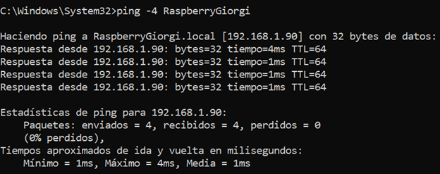
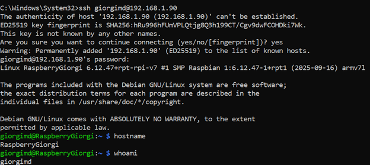
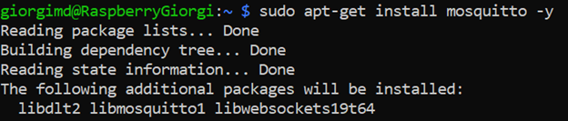
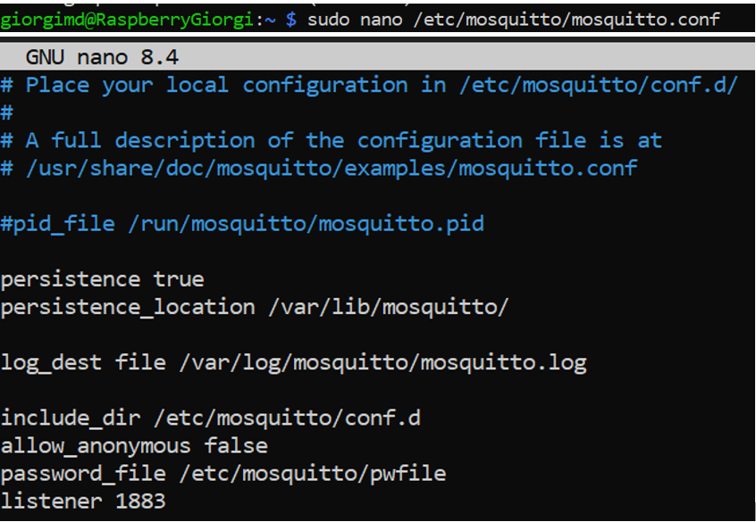
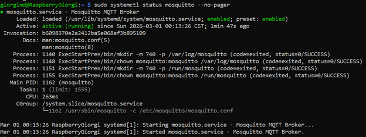
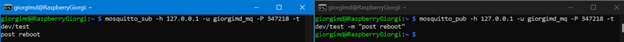
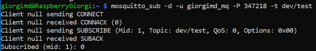
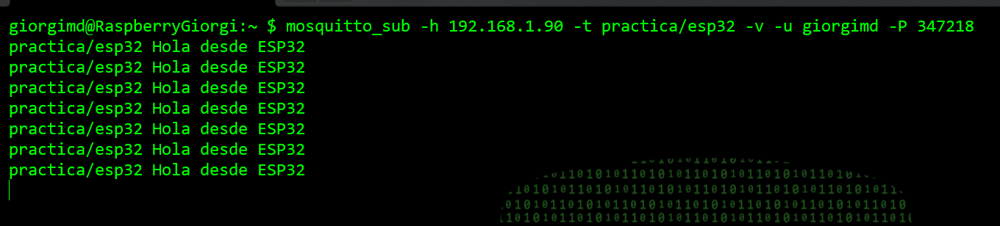

# Práctica MQTT con Raspberry Pi y ESP32

## Descripción

En esta práctica se configuró un broker **Mosquitto** en una **Raspberry Pi con Raspberry OS** y se programó una **ESP32** como **publisher** para enviar mensajes periódicos a un tópico MQTT dentro de la red local.

---

## Objetivo

Configurar una comunicación MQTT básica donde:

- La **Raspberry Pi** funcione como broker
- La **ESP32** funcione como publisher
- Los mensajes publicados sean recibidos correctamente en la Raspberry Pi

---

## 1. Obtener la IP de la Raspberry Pi

Primero se obtiene la dirección IP de la Raspberry Pi, ya que esa IP será utilizada como servidor MQTT en la ESP32.

~~~bash
hostname -I
~~~

Ejemplo:

~~~bash
192.168.1.90
~~~

---

## 2. Conexión por SSH a la Raspberry Pi

Desde otra computadora en la misma red se establece la conexión remota por SSH.

~~~bash
ssh usuario@192.168.1.90
~~~

Ejemplo:

~~~bash
ssh giorgimd@192.168.1.90
~~~

---

## 3. Actualización de paquetes e instalación de Mosquitto

Se actualiza el sistema y se instalan el broker Mosquitto y sus clientes de prueba.

~~~bash
sudo apt update
sudo apt upgrade -y
sudo apt install mosquitto mosquitto-clients -y
~~~

---

## 4. Configuración del archivo `mosquitto.conf`

Se abre el archivo de configuración principal:

~~~bash
sudo nano /etc/mosquitto/mosquitto.conf
~~~

Se deja con esta configuración básica:

~~~conf
persistence true
persistence_location /var/lib/mosquitto/

log_dest file /var/log/mosquitto/mosquitto.log

allow_anonymous true
listener 1883
~~~

### Explicación rápida

- `persistence true`: guarda datos del broker
- `persistence_location`: carpeta donde se almacenan
- `log_dest file`: guarda registros en archivo
- `allow_anonymous true`: permite conexiones sin usuario ni contraseña
- `listener 1883`: habilita el puerto MQTT por defecto

Después se reinicia y se verifica el servicio:

~~~bash
sudo systemctl restart mosquitto
sudo systemctl enable mosquitto
sudo systemctl status mosquitto
~~~

---

## 5. Prueba básica del broker

Antes de usar la ESP32, se realiza una prueba local con un subscriber y un publisher desde la Raspberry Pi.

### Terminal 1: Subscriber

~~~bash
mosquitto_sub -h 192.168.1.90 -t practica/esp32 -v
~~~

### Terminal 2: Publisher

~~~bash
mosquitto_pub -h 192.168.1.90 -t practica/esp32 -m "prueba desde raspberry"
~~~

### Resultado esperado

~~~bash
practica/esp32 prueba desde raspberry
~~~

---

## 6. Instalación de la librería PubSubClient en Arduino IDE

Para programar la ESP32 como cliente MQTT se instala la librería `PubSubClient` en Arduino IDE.

### Pasos

1. Abrir **Arduino IDE**
2. Ir a **Programa**
3. Seleccionar **Incluir librería**
4. Entrar a **Administrar bibliotecas...**
5. Buscar **PubSubClient**
6. Instalar la librería

---

## 7. Configuración de la ESP32 en Arduino IDE

Antes de cargar el programa:

1. Conectar la ESP32 por USB
2. Ir a **Herramientas > Placa**
3. Seleccionar la tarjeta ESP32 correspondiente
4. Ir a **Herramientas > Puerto**
5. Elegir el puerto COM detectado

---

## 8. Código `.ino` de la ESP32

~~~cpp
#include <WiFi.h>
#include <PubSubClient.h>

const char* ssid = "TU_RED_WIFI";
const char* password = "TU_PASSWORD_WIFI";
const char* mqtt_server = "192.168.1.90";
const int mqtt_port = 1883;
const char* topic = "practica/esp32";

WiFiClient espClient;
PubSubClient client(espClient);

void conectarWiFi() {
  Serial.println("Conectando a WiFi...");
  WiFi.begin(ssid, password);

  while (WiFi.status() != WL_CONNECTED) {
    delay(500);
    Serial.print(".");
  }

  Serial.println();
  Serial.println("WiFi conectado");
  Serial.print("IP de la ESP32: ");
  Serial.println(WiFi.localIP());
}

void conectarMQTT() {
  while (!client.connected()) {
    Serial.print("Conectando al broker MQTT... ");

    String clientId = "ESP32-";
    clientId += String(random(0xffff), HEX);

    if (client.connect(clientId.c_str())) {
      Serial.println("conectado");
    } else {
      Serial.print("fallo, estado=");
      Serial.print(client.state());
      Serial.println(" reintentando en 2 segundos");
      delay(2000);
    }
  }
}

void setup() {
  Serial.begin(115200);
  delay(1000);

  conectarWiFi();
  client.setServer(mqtt_server, mqtt_port);
}

void loop() {
  if (!client.connected()) {
    conectarMQTT();
  }

  client.loop();

  String mensaje = "Hola desde ESP32";
  Serial.print("Publicando: ");
  Serial.println(mensaje);

  client.publish(topic, mensaje.c_str());

  delay(5000);
}
~~~

---

## 9. Explicación del código por partes

### Librerías

~~~cpp
#include <WiFi.h>
#include <PubSubClient.h>
~~~

- `WiFi.h` permite conectar la ESP32 a la red inalámbrica
- `PubSubClient.h` permite conectarse al broker MQTT y publicar mensajes

### Datos de conexión

~~~cpp
const char* ssid = "TU_RED_WIFI";
const char* password = "TU_PASSWORD_WIFI";
const char* mqtt_server = "192.168.1.90";
const int mqtt_port = 1883;
const char* topic = "practica/esp32";
~~~

Aquí se definen:

- nombre de la red WiFi
- contraseña de la red
- IP del broker Mosquitto
- puerto MQTT
- tópico de publicación

### Cliente WiFi y cliente MQTT

~~~cpp
WiFiClient espClient;
PubSubClient client(espClient);
~~~

Se crea primero un cliente de red y después se usa para construir el cliente MQTT.

### Función `conectarWiFi()`

~~~cpp
void conectarWiFi() {
  Serial.println("Conectando a WiFi...");
  WiFi.begin(ssid, password);

  while (WiFi.status() != WL_CONNECTED) {
    delay(500);
    Serial.print(".");
  }

  Serial.println();
  Serial.println("WiFi conectado");
  Serial.print("IP de la ESP32: ");
  Serial.println(WiFi.localIP());
}
~~~

Esta función conecta la ESP32 a la red WiFi y muestra en el monitor serial la IP obtenida.

### Función `conectarMQTT()`

~~~cpp
void conectarMQTT() {
  while (!client.connected()) {
    Serial.print("Conectando al broker MQTT... ");

    String clientId = "ESP32-";
    clientId += String(random(0xffff), HEX);

    if (client.connect(clientId.c_str())) {
      Serial.println("conectado");
    } else {
      Serial.print("fallo, estado=");
      Serial.print(client.state());
      Serial.println(" reintentando en 2 segundos");
      delay(2000);
    }
  }
}
~~~

Esta función intenta conectar la ESP32 al broker MQTT. Si falla, espera 2 segundos y vuelve a intentarlo.

### Función `setup()`

~~~cpp
void setup() {
  Serial.begin(115200);
  delay(1000);

  conectarWiFi();
  client.setServer(mqtt_server, mqtt_port);
}
~~~

En esta parte se inicia la comunicación serial, se conecta la ESP32 al WiFi y se define el broker MQTT.

### Función `loop()`

~~~cpp
void loop() {
  if (!client.connected()) {
    conectarMQTT();
  }

  client.loop();

  String mensaje = "Hola desde ESP32";
  Serial.print("Publicando: ");
  Serial.println(mensaje);

  client.publish(topic, mensaje.c_str());

  delay(5000);
}
~~~

Aquí se mantiene la conexión MQTT activa y se publica el mensaje `"Hola desde ESP32"` cada 5 segundos.

---

## 10. Cargar el programa a la ESP32

1. Conectar la ESP32 por USB
2. Dar clic en **Verificar**
3. Dar clic en **Subir**
4. Esperar a que termine la carga del programa

---

## 11. Verificación de comunicación

En la Raspberry Pi se deja escuchando el tópico:

~~~bash
mosquitto_sub -h 192.168.1.90 -t practica/esp32 -v
~~~

Si todo funciona correctamente, deben recibirse mensajes como estos:

~~~bash
practica/esp32 Hola desde ESP32
practica/esp32 Hola desde ESP32
practica/esp32 Hola desde ESP32
~~~

En el monitor serial de la ESP32 debe observarse algo similar a esto:

~~~bash
Conectando a WiFi...
WiFi conectado
IP de la ESP32: 192.168.1.X
Conectando al broker MQTT... conectado
Publicando: Hola desde ESP32
Publicando: Hola desde ESP32
Publicando: Hola desde ESP32
~~~

